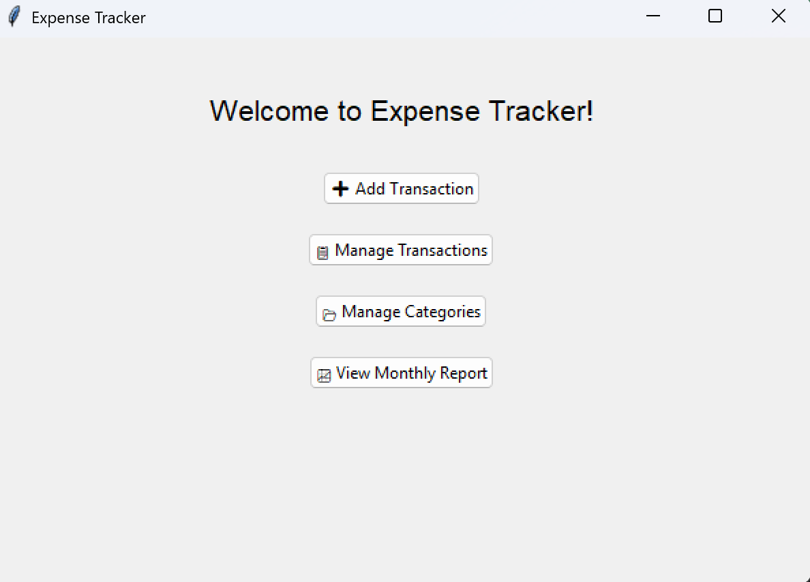
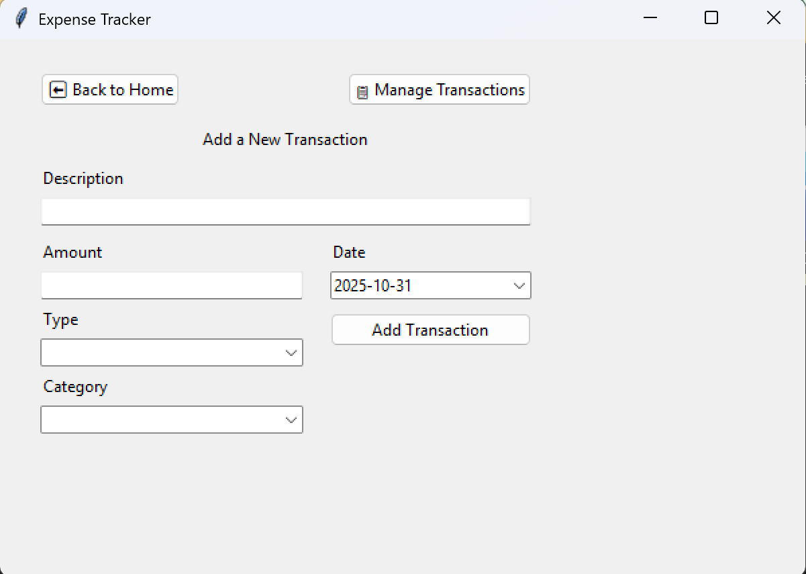
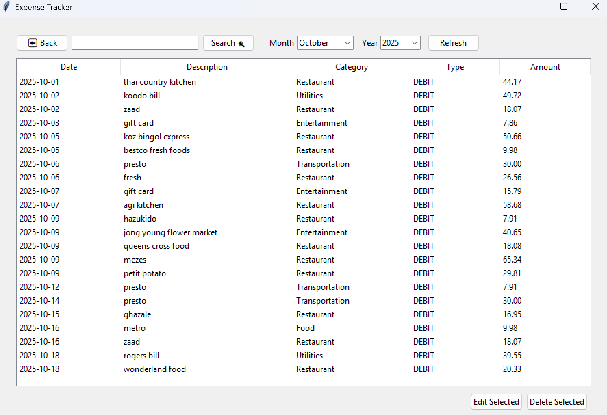
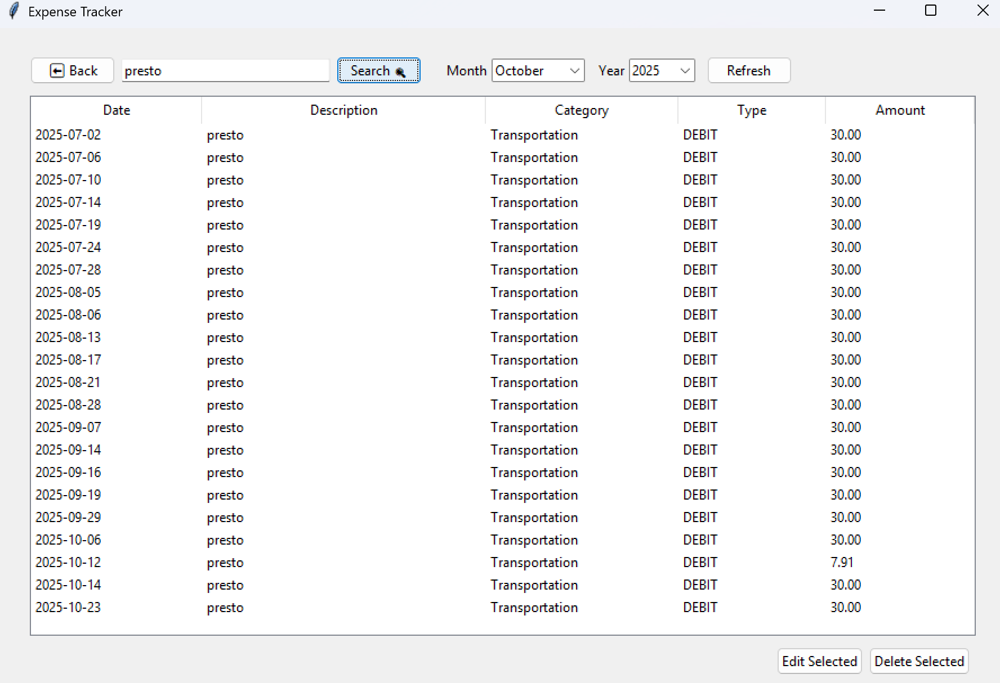
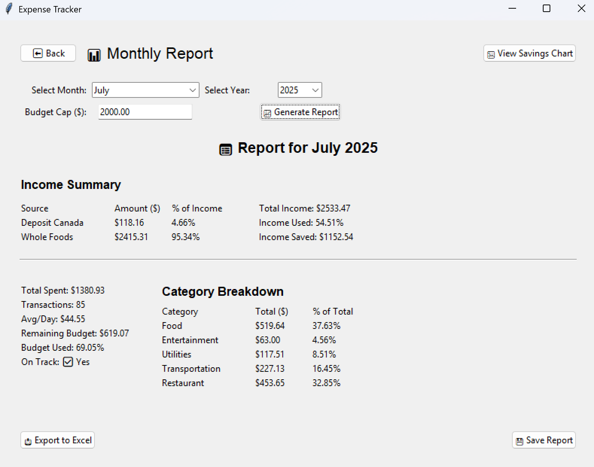
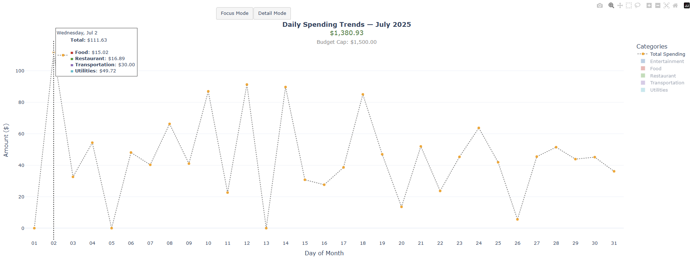
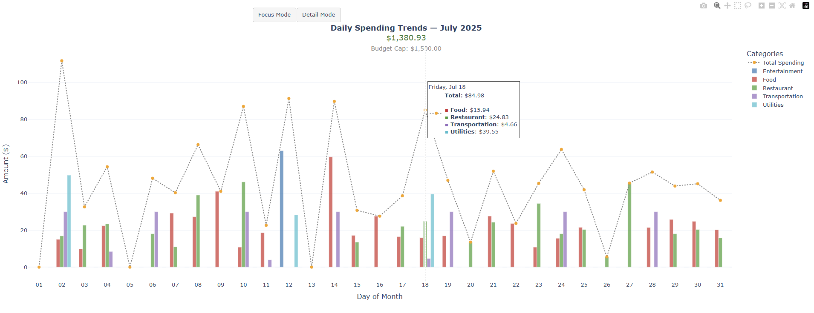
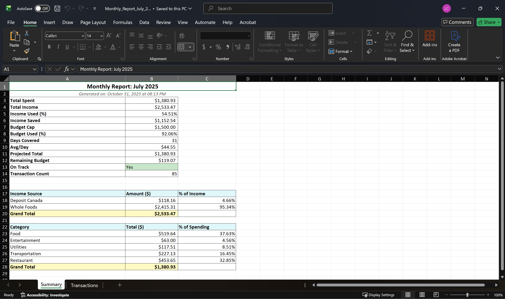
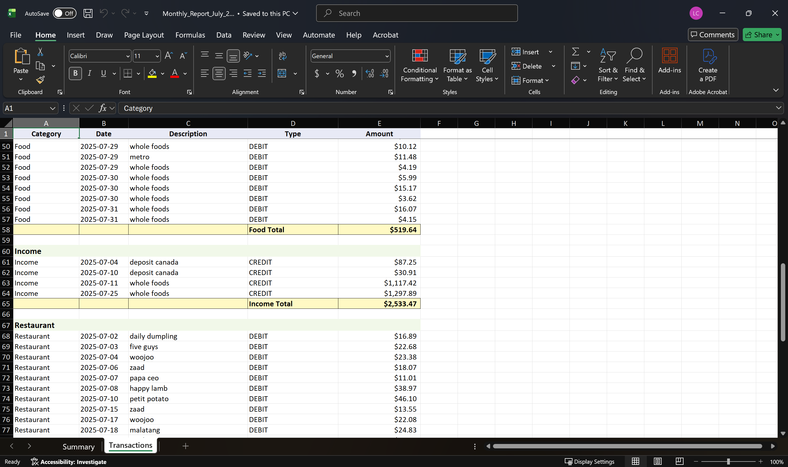
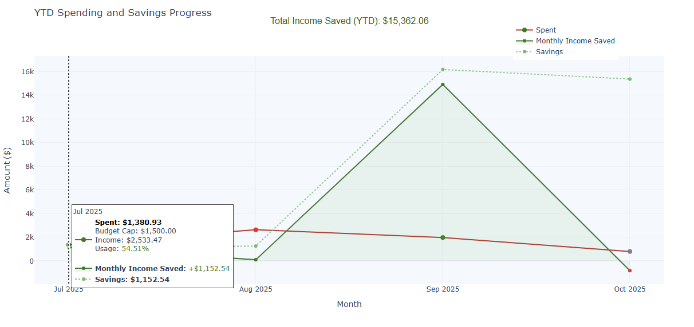

# 💰 Expense Tracker — Personal Finance Desktop App (Python + SQLite)

A desktop-based expense tracking application built with **Python**, **Tkinter**, and **SQLite**.  
It provides an intuitive interface for managing transactions, generating reports, visualizing spending trends, and exporting Excel summaries. All locally and offline.

---

## 🖥️ Features

### ✅ Core Functionality
- Add, edit, and delete **transactions** (income & expenses)
- Organize spending into **custom categories**
- Generate **monthly financial reports** with spending and income summaries
- Export full reports to **Excel** with auto-formatted summaries and charts
- Interactive **Plotly charts** showing spending and savings trends
- Track **income usage**, savings, and remaining budget over time
- Local, offline-first all data stored securely using **SQLite**

---

## 📸 Screenshots

### 🏠 Home Screen


### ➕ Add Transaction


### 📋 Manage Transactions


### 🔍 Search Transactions


### 📂 Manage Categories


### 📊 Monthly Report


### 📈 Daily Spending Chart



### 💾 Excel Export — Summary Sheet


### 💾 Excel Export — Transactions Sheet


### 💹 Year-to-Date (YTD) Savings Chart


---

## ⚙️ Tech Stack

| Component | Technology |
|------------|-------------|
| **Frontend (UI)** | Tkinter |
| **Backend / Logic** | Python 3 |
| **Database** | SQLite |
| **Data Visualization** | Plotly |
| **Excel Export** | OpenPyXL |
| **Architecture** | MVC-inspired modular structure (models, repositories, pages, services, interfaces) |

---

## 🧱 Project Structure

```text
ExpenseTracker/
├── interfaces/              # Entity interfaces (contracts for models)
├── models/                  # Data models (Transaction, Category, Report, etc.)
├── repositories/            # SQLite database access layer
├── pages/                   # Tkinter GUI pages
├── services/                # Business logic, chart rendering, Excel export
│
├── main.py                  # Application entry point
├── expenseTracker.sqlite    # Local database
└── README.md
```

## 📊 Data Flow Overview
- User adds a transaction → stored in SQLite (transaction table).

- Categories are loaded dynamically from the database or created by user.

- Monthly reports aggregate income and expenses by category.

- Charts visualize spending/saving patterns using Plotly.

- Reports can be exported as .xlsx with full formatting and summary stats.

## 🧠 Upcoming Features (Planned)
*Phase 2: Intelligence & Automation*

- AI Insights (local or GPT-based): Personalized financial summaries and suggestions.

- Bank Integration: Auto-import transactions via Open Banking APIs (CIBC, RBC, etc.).

- Multi-account support: Link checking, savings, and credit accounts.

- Cross-platform: Rebuild UI using for mobile and desktop.

- User profiles: Cloud-based sync with FastAPI backend.

## 👨‍💻 Author
Lucas Caridi

This project is open-source under the MIT License. Feel free to use and improve it.

Expense Tracker was created as a fully local, privacy-first solution for tracking personal finances 
— built entirely in Python.